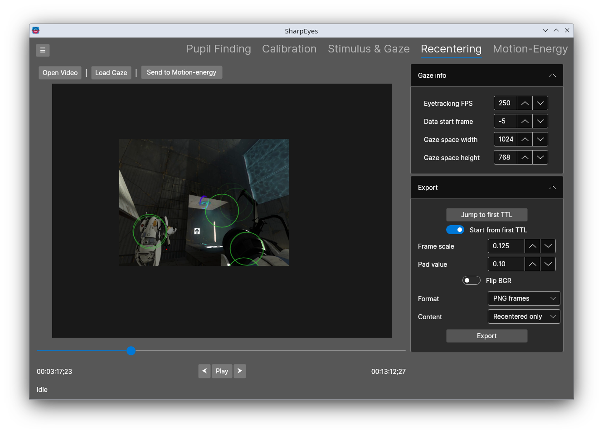

   # SharpEyes

A program for doing eyetracking and making motion-energy features out of stimulus videos.
SharpEyes offers a UI for finding pupils in eyetracking videos, and the ability to edit the pupil locations manually to ensure data quality.
It then lets you overlay the gaze on the stimulus to look at eyetraces, and then also the option to manually correct that again.

Given traces and stimulus video, you can then recenter the video to be retinotopic, and generate motion-energy features from stimuli.
The motion-energy features are actually processed by [PyMoten](https://github.com/gallantlab/pymoten), but the user doesn't have to interact at all with it. Sharpeyes will handle everything under the hood, including setup.

See the [Documentation](https://gallantlab.org/SharpEyes) for full details.

## Workflow

SharpEyes is organized into five tabs, each corresponding to a stage of processing:

**Pupil Finding** — Takes a raw eyetracking video and finds the pupil location in every frame. Uses a semi-automatic model-free template matching algorithm, and results are hand-editable.

**Calibration** — (Yet to be implemented) Maps from pupil position in video space to gaze in stimulus display space.

**Stimulus & Gaze** — (Start here if you already have gaze location in screen space) Check gaze location overlaid on the stimulus. Allows filtering of the gaze traces and and manual editing of individual gaze positions. Reads numpy arrays, CSV, and Eyelink EDF files / converted text files.

**Recentering** — Shifts each frame of the stimulus video so that the gaze position is always at the center of the output, producing a retinotopic video that matches (theoretically) what visual cortex sees. This can either export the recentered frames as a numpy array or PNGs, or send it to the motion-energy computations.

**Motion-Energy** — Computes motion-energy features from the stimulus video using [PyMoten](https://github.com/gallantlab/pymoten), and allows you to visualize the filters in stimulus space. It will save the filter responses out as a numpy array, along with a plain-text parameter log and a CSV describing each filter in the pyramid. In future versions, it will also visualize the filter responses as you play the stimulus video.

## Installation

Precompiled executables are available on the [Releases page](https://github.com/gallantlab/SharpEyes/releases) for both Windows and Linux (Ubuntu 24.04). The Windows exe is fully self-contained, but the Linux version may require additional system libraries, and SharpEyes will report any that are missing. 

Because .Net is cross-platform, this will also run on macOS (and any other .Net desktop environment, provided there are OpenCV and Avalonia package for them). However, you will need to build from source for non-Windows/Linux environments.

## Requirements

This is targeted at and tested with .NET 10 on Window 10/11 (though I see no reason why it shouldn't work down to Windows 7) and Ubuntu 24 (some fudging might be needed to get OpenCVSharp working on other versions).

Because it's .Net, it will also run on macOS, but you need to build it from scratch, and it's not tested.

If you would like to do things to the code, this is written using Visual Studio (not code) and Jetbrains Rider.

## Resources used

* [Avalonia UI](https://avaloniaui.net) for the UI
* [OpenCvSharp](https://github.com/shimat/opencvsharp) for video processing
* [NumSharp Lite](https://github.com/SciSharp/NumSharp.Lite) for NumPy interop
* [Python.Net](https://github.com/pythonnet/pythonnet) for Python interop
* [PyMoten](https://github.com/gallantlab/pymoten) for motion-energy feature extraction
* Icons8 application icon
