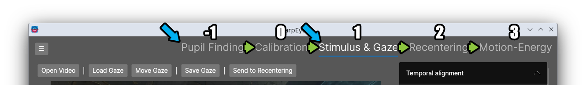

# Workflow

SharpEyes's workflow is divided into five tabs, each corresponding to a stage of processing. 

The pupil finding and calibration pages are for when you have a raw video from the eyetracking camera and need to extract gaze information. In our case, we have an Avotec system that can put out the video.

If you already have gaze information (i.e. stimulu XY locations for them), you can skip to Stimulus & Gaze.

The tabs are conveniently set up in order of the workflow: greenarrow are the flow, and blue are entry points!

**[Pupil Finding](pupil finding.md)** takes a raw eyetracking video and finds the pupil location in each frame. This is the first step for any eyetracking data.

**[Calibration](calibration.md)** maps from pupil video space to stimulus display space, producing gaze positions that can be overlaid on the stimulus.

**[Stimulus & Gaze](stimulus and gaze.md)** lets you view the gaze location overlaid on the stimulus video, filter the gaze traces to smooth them, and manually edit individual gaze positions when needed.

**[Recentering](recentering.md)** uses the gaze location to shift and crop the stimulus video so that the gaze is always centered, producing a retinotopic video.

**[Motion-Energy](motion energy.md)** computes motion-energy features from either the recentered videos or from the raw stimulus video, using [PyMoten](https://github.com/gallantlab/pymoten) under the hood.

Each tab page includes a full controls reference. Hotkeys and menu items for pupil finding are documented on the [Pupil Finding](pupil finding.md) page. Common questions are in the [FAQs](../faq.md).
