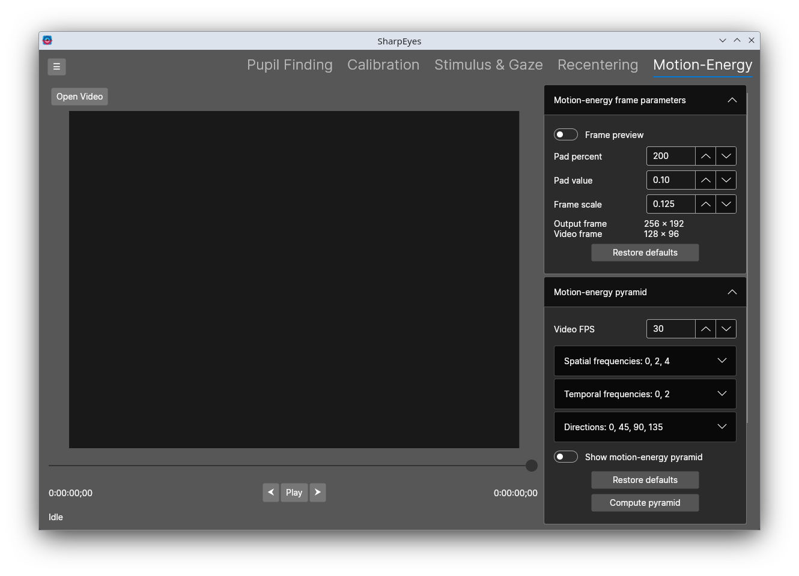

# Motion-Energy

The Motion-Energy tab computes motion-energy features from a video using [PyMoten](https://github.com/gallantlab/pymoten). 
It can operate on recentered video sent from the [Recentering](recentering.md) tab, or on a raw video loaded directly. 
If you want to compute motion-energy for retinotopic videos, then they _have_ to be sent over from the [Recentering](./recentering.md) tab. 
The video preview overlays the motion-energy pyramid on the frames so you can visually verify the filter parameters before committing to a full computation.
If you have computed motion-energy features, you can use the "Load Features" button to select the text file that SharpEyes generated, 
and read in the previously computed features and thei parameters along with the video and eyetracking information.

## Motion-energy frame parameters

These control how the input video frames are prepared before being passed to PyMoten.

By default the video is shown as a preview by sliding the original video around on the drawing canvas. Toggle the "preview" button on to preview the actual pixel values that the motion-energy code will see.

| Control | Description |
|---|---|
| Pad percent | Amount of padding added around each frame as a percentage of the frame size. Must be at least 100 (i.e. the padded frame is at least the original size). Recentered/retinotopic videos must be padded, but a raw video can do without padding. |
| Pad value | Pixel value (0.0–1.0) used to fill the padding area |
| Frame scale | Scale factor applied to each frame before processing. Lower values reduce computation time at the cost of spatial resolution. |
| Output frame | Displays the resulting output frame size given the current parameters |
| Video frame | Displays the original video frame size |

Click **Restore defaults** to reset these parameters.

## Motion-energy pyramid

These control the filter bank that PyMoten uses to decompose the video into motion-energy features.

| Control | Description                                                                                                                                                                                                                                                                                                  |
|---|--------------------------------------------------------------------------------------------------------------------------------------------------------------------------------------------------------------------------------------------------------------------------------------------------------------|
| Video FPS | Frame rate of the input video, used to convert temporal frequencies from cycles/second to cycles/frame. This is read from the video but can be overridden                                                                                                                                                    |
| Spatial frequencies | The spatial frequencies (cycles/image) to include in the pyramid. Select multiple; use + and − to add or remove values.                                                                                                                                                                                      |
| Temporal frequencies | The temporal frequencies (cycles/second) to include in the pyramid. Select multiple; use + and − to add or remove values.                                                                                                                                                                                    |
| Directions | The motion directions (degrees) to include in the pyramid. Select multiple; use + and − to add or remove values.                                                                                                                                                                                             |
| Show motion-energy pyramid | When enabled, the pyramid filters are overlaid on the video preview as circles and arrows so you can verify coverage.                                                                                                                                                                                        |
| Show dynamic responses | When enabled, the pyramid overlay is colored by the computed filter responses for the current frame. Only available after a feature extraction run completes or if saved features are loaded. If filter parameters have changed since the last extraction, the responses are stale and should be recomputed. |
| Response scaling | Controls how filter responses are normalized before being mapped to opacity. Options: **Per-filter** (each filter is normalized against its own maximum), **Global** (all filters share the same maximum), **Percentile** (uses the 95th percentile as the ceiling), **Logarithmic** (log-scaled).           |
| Max opacity | Maximum opacity applied to the dynamic response overlay elements at full response strength.                                                                                                                                                                                                                  |

Click **Compute pyramid** to compute and display the pyramid for the current frame. Click **Restore defaults** to reset the pyramid parameters to their defaults.

## Compute backend

The **Backend** dropdown selects which compute backend PyMoten uses for the current run. The available options depend on what is installed in your Python environment:

| Backend | Description |
|---|---|
| numpy | CPU-based computation using NumPy. Always available. |
| torch (CPU) | PyTorch running on CPU. |
| torch (CUDA) | PyTorch using an NVIDIA GPU via CUDA. Shown only if a compatible GPU is detected. |
| torch (MPS) | PyTorch using Apple Silicon GPU via MPS. Shown only on macOS with MPS support. |

The preferred backend order is configured in Python Settings. After a compute run completes, any GPU memory used by the CUDA backend is released automatically.

## Compute features

Once the frame parameters, pyramid, and backend are configured, click **Compute features** to run the full feature extraction over the video. The following options are available before running:

| Control | Description                                                                                                                                                                                                                                                                                           |
|---|-------------------------------------------------------------------------------------------------------------------------------------------------------------------------------------------------------------------------------------------------------------------------------------------------------|
| Compute dtype | Floating-point precision of the output features array: `float16`\*, `float32` (default), or `float64`.                                                                                                                                                                                                |
| Missing gaze | How to handle video frames where gaze position is absent or invalid. **Zeros** fills those rows in the output with zeros; **NaN** fills them with NaN; **Do nothing** leaves them unchanged.                                                                                                          |
| Start frame | Frame number at which extraction begins.                                                                                                                                                                                                                                                              |
| Batch filters | When enabled, filter responses are computed in groups rather than one filter at a time. Useful on backends that can parallelize across filters. Set **Filter batch size** to control how many filters are processed per batch. The **All** button sets the batch size to the total number of filters. |
| Batch frames | When enabled, the stimulus frames are split into batches rather than processed all at once. Set **Frame batch size** to control how many frames are included per batch.                                                                                                                               |
| Stimulus frames in CPU | Keep the full stimulus frame tensor on CPU; only the current batch is transferred to the GPU. Reduces peak GPU memory use when frame batching is on.                                                                                                                                                  |
| Filter responses in CPU | Accumulate the filter response tensor on CPU; each batch's output is copied off the GPU immediately rather than held in VRAM for the full run. Reduces peak GPU memory use when filter batching is on.                                                                                                |

\* **Note**: the scale filter responses, especially for spatially large ones, can easily overflow half-precision 
floating point limits and get you `infs`. It's best to use at least single precision.

While computing, the button changes to **Cancel** to interrupt the run.

After extraction completes, a save dialog prompts for the output path. Three files are saved, all sharing the same base name:

**`{name} motion energy.npy`** — the features array, shape `[frames × filters]`. Each row is one video frame; each column is one filter from the pyramid.

**`{name} info.txt`** — a human-readable record of all parameters used for the run, including:

- Stimulus video path, FPS, frame size, and duration
- Gaze file path
- Gaze info: eyetracking FPS, data start frame, gaze space dimensions
- Gaze filtering settings (median filter window, outlier removal thresholds), or "None" if filtering was disabled
- Motion-energy parameters: pad percent, pad value, frame scale, output and video frame sizes, video FPS, spatial/temporal frequencies, directions, and start frame

**`{name} motion-energy filters.csv`** — one row per filter in the pyramid, with columns: Y center, X center, Direction (degrees), Spatial Frequency, Spatial Envelope, Temporal Frequency, Temporal Envelope, Temporal width, Spatial phase offset. All spatial values are in pixels at the output frame size.
